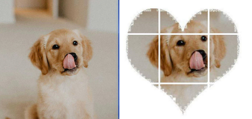

## 制作朋友圈九宫格图像拼图

<p align="left">
    <a href="https://colab.research.google.com/github/SWHL/MakeJiuGongGeImages/blob/master/MakeJiuGongGeImages.ipynb" target="_blank"></a>
    <a href="./LICENSE"></a>
    <a href=""></a>
</p>

#### 效果图：


#### 所需环境

- python
- opencv-python
- numpy

#### 运行

```shell
python make_JiuGongGe_images.py

# out
# 九宫格图已经保存在/assets/results/1下，序号顺序为从左到右
```

#### 说明
- 程序运行完之后，会将9个图像保存在`/assets/results/1`下，图像编号顺序就是在九宫格中的顺序
- 接下来，可以将这9张图上传到朋友圈，秀一波

#### 参考资料
- [程序员的七夕：Python生成女神的九宫格心形图像](https://www.cnblogs.com/shiwanghualuo/p/13562491.html)